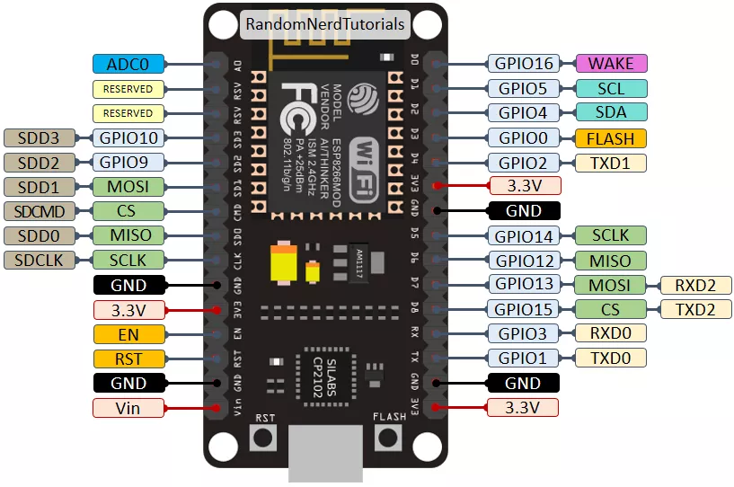
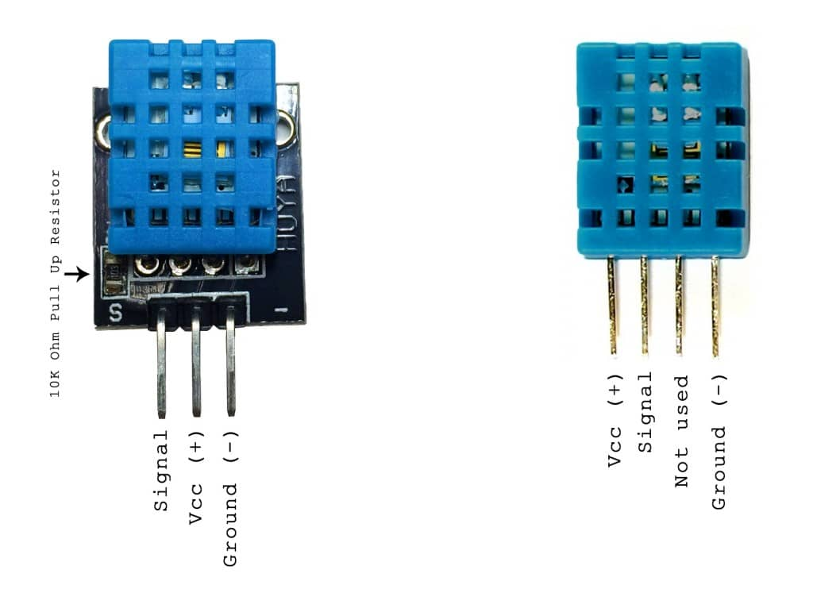

# arduino

## NodeMCU-ESP8266



```c
static const uint8_t D0 = 16;
static const uint8_t D1 = 5;
static const uint8_t D2 = 4;
static const uint8_t D3 = 0;
static const uint8_t D4 = 2;
static const uint8_t D5 = 14;
static const uint8_t D6 = 12;
static const uint8_t D7 = 13;
static const uint8_t D8 = 15;
static const uint8_t D9 = 3;
static const uint8_t D10 = 1;
```

## Humidity & Temperature sensor



[DHT11]: https://www.circuitbasics.com/how-to-set-up-the-dht11-humidity-sensor-on-an-arduino/	"DHT11"

uses just one signal wire to transmit data to the Arduino. Vcc is 5V.

## Active Buzzer

[ DHT11 ]: https://startingelectronics.org/tutorials/arduino/modules/active-buzzer/ "DHT11"

Vcc is connected to analog pin. GND to GND pin.

## Photoresistor
[ KY-018 ]: https://arduinomodules.info/ky-018-photoresistor-module/ "KY-018 "
S: Pin Analog, middle: +5V, -: GND

